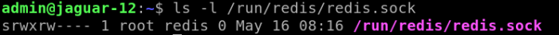

# HLD Redis Security #

## Table of Content 

### Revision

###  1.1. Revision
|  Rev  |  Date   |      Author      | Change Description |
| :---: | :-----: | :--------------: | ------------------ |
|  0.1  | 07/2023 |   David Pilnik   | Phase 1 Design     |

### Scope  

This Redis Security hld doc described the requirements, architecture and configuration details of Redis Security feature in switches SONIC OS based.

### Definitions/Abbreviations 
	Redis ACL	Redis Access control list
	API	Application Programmable Interface
	PW	Password
	AUTH	authentication
	unprivileged user = monitor user = read-only user.

### Overview 

In the original SONiC Arch any user can connect to Redis DB, have access to all the Redis actions, Redis keys and as a result of that corrupt/attack the Redis DB. This is a security gap.
This Redis Hardening HLD goal is to support the security of SONiC Redis DB by doing the following modifications:
1. accessed by admin/root users will support all Redis actions and Redis keys.
2. unprivileged users will be able to do read-only actions only and Redis keys 
This security design mainly will be supported by integrating a Redis security feature name Redis ACL.

### Requirements

This section lists all the requirements for the HLD coverage and exemptions (not supported) if any for this design.
- Communication between containers and host via Redis should remain available as before this security enhancement.
- Admin Users should be able to support all the actions and access any key in Redis.
- Redis will support communication via UDS and TCP.
- When using a TCP connection, Redis must use TLS as well, other the auth PW of Redis will be possible to "eve drop" (visible in the network connection).
- The community requires to give read-only actions to unprivileged users of Redis DB. In SONiC show command will not work if the user has no right to REDIS ACL and to the Redis socket
There are 2 possible options:
  - Add Redis group to unprivileged users for the user that need Redis access. And those users will be able to do Read-Only operation only (supported by Redis ACL rule).
  - Add Redis socket W/R access to all users and unprivileged users will be able to do Read-Only operation only (supported by Redis ACL rule).
- Redis users without passing authentication will have no access to any DB.
- The Redis users will have a PW to authenticate to Redis, this PW will be saved with access permission only to the corresponding Linux users'. (more detail in Storage Chapter)
- A Redis user password will be created in the installation phase with a random value. (If possible will be done in boot time)

### Architecture Design 

Redis Arch will be modified in order to support security.
Arc design diagram\

SONiC-OS is a container-based OS, and those containers and daemons in the host communicate between them using Redis DB.
For example, hostcfgd daemon can be triggered by setting some configuration in some Redis DB Table with subscribe consumer mechanism.
This communication by modifying the Redis table is happening without any authentication.
Redis have a default username "default", this user has access to any key and access to all the actions in Redis.

The security issue with this design, it's that any user even monitors users can create a code and connect to any Redis DB and do any actions including corruption Redis DB.
This doc will show Redis Security Arch for this problem, the solution described in the Flows chapter with more details.

#### Redis security solution
The solution will be by enforcing authentication to the Redis DB, the authentication is supported by the Redis ACL feature which is required to create a new user in Redis Server and configure his permissions.
The main idea is to create 2 Redis users:
Redis admin user: permission to all action

- Redis unprivileged (no-admin) user: permission to read-only.

- Linux admin user will pass authentication with Redis admin user

- Linux unprivileged users will pass authentication with Redis unprivileged users.

- Linux users that do not pass authentication with any of those 2 Redis users, will have no access to Redis DB.

Note: there is a possibility in the future to modify that permission and use the Redis "key" granularity.

#### Redis ACL

Redis ACL link: https://redis.io/docs/management/security/acl/

Redis ACL feature is a built-in security feature in Redis that will be enabled in this Redis Security Feature.

Redis ACL is designed to have 3 degrees: user, keys, and commands. So when you are going to set an ACL, basically from Redis POV, its needs to create a user and set which command access you need and which keys you need, it works like a whitelist.
By default and in today's SONiC design, there is a default Redis user named "default", and this user has access to all keys and commands and has no password.

So even Linux monitors users or any user can connect & corrupt the Redis DB.
The usage of REDIS ACL AUTH will solve this issue.
At a high level, the design will be:

- Linux admin users will have access to Redis with a Redis username "admin" with permission to any Redis command and keys. 
- Linux no-admin (unprivileged) users will have read-only access to Redis DBs.

### High-Level Design 

Redis design diagram\

#### Redis Server Security
The Redis server exists in the database container and will be enhanced by enabling ACL feature support.
The Server will include the following ACL configuration in the server Redis configuration file name /etc/redis/redis.conf.

- admin user supports any action
- monitor user support read-only actions.
- disable default user

#redis.conf

	user user_admin on +@all -DEBUG ~* >secret

creating user user_admin, +@all meaning that can do any operation, -DEBUG not necessary in the release version, ~* all keys available in any DB, this is the password "secret".
The password will be stored in a safe place, not plaintext as in this example

#redis.conf

	user user_monitor on ~* +hget +get -DEBUG >secret_monitor

creating user user_monitor, +hget meaning that can do just hget operation, probably we will need to add more operators to monitor, -DEBUG not necessary in the release version, ~* all keys available in any DB

#redis.conf
	user default off

disable the user default.

#### HiRedis 
Hiredis is a minimalistic C client library for the Redis database.

It is minimalistic because it just adds minimal support for the protocol, but at the same time it uses a high level printf-alike API in order to make it much higher level than otherwise suggested by its minimal code base and the lack of explicit bindings for every Redis command.

repo https://github.com/redis/hiredis

#### Redis client - swsscommon -
The SWitch State Service (SWSS) common library provides libraries for database communications, Netlink wrappers, and other functions needed by SWSS.

In the context of this feature, it will be added the authentication Redis ACL step code in this library, so will not require coding in any daemon that access Redis DB just in this library.

Algorithm

The swsscommon is calling the Redis client "Hireredis" with his API, so in order to support the Redis security we will add one more call for authentication which will be contained the username and password.
This authentication call will pass to Hiredis as others call and then the Redis server will verify the authentication information.

If the password is approved by Redis Server the flow will proceed as in the past, other will be an error msg.

Code aggregation to support the authentication phase:

	#sonic-swss-common repo: common/dbconnector.cpp
	string command("auth admin secret");
	RedisReply r1(this, command, REDIS_REPLY_STATUS);
	username: admin
	PW: secret

note: the password will be saved safely and not plaintext in the code.

#### Redis client - swsssdk -
There is an older Redis client library to connect to Redis Server, this library support call from Python only based on redis-py lib.
According to the documentation this old library it's supporting also Redis ACL.

SONiC Redis: https://github.com/sonic-net/sonic-py-swsssdk

redis-py (used by swsssdk)

https://redis-py.readthedocs.io/en/stable/commands.html

#### Redis authentication flow diagram

#### Redis flow description
The flow of each daemon when accessing the Redis DB is going through SONiC Redis libraries such as Swsscommon/Swsssdk, those libraries are calling to Hiredis (Redis client), and then requests from Hiredis will be sent to Redis Server that listening in the database container.
The modification in Redis flow to be secure will be by adding support of Redis ACL including the Auth Redis phase.
This auth step will be triggered from the swsscommon/swsssdk and this request will be received in the Redis server through Hiredis (seen in purple arrows in the diagram).

Then the Redis server will verify the username & password that was stick to the auth request, and if it's valid the daemon will be able to connect and get/set info to Redis DB, if invalid the client will receive an error that authentication failed, and will not be able to get any info from Redis DB.

### Secret/PW storage

#### PW generation

The key will be created in installation time (we will test the effort to do it in boot time).

The password of the new Redis users should be stored in a safe place.

Password cannot be created & stored in the image in build time - it's not a good practice, that because our image it's not encrypted, so technically anyone can read the content and get access.
In addition, it's required to have PW uniqueness between platforms, so, saving it hard-coded will not support this requirement as well.

Common Linux user has a default password hard-coded in build-time, but that it's because we implemented a feature named California-law that enforce the user to modify the password after the first boot.

In the case of Redis, the user doesn't really need to prompt a password, the password/secret need mainly accessed from the swsscommon library that accesses Redis DB via sending a request to the server through Hiredis.

As a result of that, the Redis passwords will be generated randomly during the installation time.
How to generate the Redis password/secret:
The Redis password will be created by OpenSSL - https://www.misterpki.com/openssl-rand/
OpenSSL password generation code example:

PW generation code example

	openssl rand -base64 12
#### PW location

The Key/PW will require access from the Redis client (swsscommon/swsssdk) and will require access from Redis Server.

##### Details of Redis client PW

The Redis client PW access will is defined by the following:

- Linux admin user will have access to Redis admin PW.
- Linux unprivileged users will have access to Redis unprivileged PW only.

Details

Redis password/secret stored place:
The library named swsscommon, coded in CPP will require access to the password in order to send the authentication request to Redis.

Admin users that running this code are part of the sudoers group, so should be feasible to store the password in /etc/shadow-redis with permission to root only.

From the other side, Redis monitor users that will require access to the password as well, will not be able to access /etc/shadow-redis due to permissions, so will be stored the Redis monitor password in a different filename:
shadow-redis-monitor with permission to monitor group only, meaning that users that belong to the monitor group will have access to this file, so they will be able to authenticate to Redis.

As a result of that, users that do not belong to the admin/monitor group will be not able to connect to any Redis DB.

##### Details of Server PW

PW management access in Redis Server

Redis Server required access to any the Redis User, and as a result of that is required to save the PW in redis.conf
This could be not good enough safety because the redis.conf belongs to the group redis, and a user can have read access to redis.conf.

So, the solution will be the following:

Save the PW in a different file with root access permission and just set the path in the redis.conf. This is supported by Redis ACL and the file where the PW is saved has a suffix .acl.

Add the following line in redis.conf:

	aclfile /etc/redis/users.acl
	the file should contain the same syntax as when adding an acl user.
	permission to the file by default is:
	-rw-r--r-- 1 root redis 46 May 17 11:04 /etc/redis/users.acl
	required to be changed to root only:
	-rw-r--r-- 1 root root 46 May 17 11:04 /etc/redis/users.acl
	restart redis service

### Redis UDS
In the origin, Redis UDS was only supported to admin users (redis group) and not to unprivileged user, meaning that unprivileged user was required to connect by TCP.

The plan is to support the connection to Redis via the unix domain socket to any user, but, unprivileged user will be able to read-only from Redis DB by using Redis ACL feature.
How to:

UDS access can be granted by giving permission to the filename redis.sock (shown aboved).

This redis UDS support to any user can be done by the following options:

1. adding unprivileged users to the Redis group. By doing that, they will manage to connect to Redis DB via UDS and will be restricted to reading only by the Redis ACL rules.

The password of the Redis unprivileged user can be saved with access just by Linux users that belong to the Redis group.

The password of the Redis admin user can be saved with access just by Linux Admin users. So, the monitor user that will try to read the admin PW will fail. 

2. Give socket permission redis.sock to all the users and make read-only possible to unprivileged users by using ACL.

Note:
option 2: I think about one attack vector, that a new user can remove this socket file and break the communication. (not sure this is a real case.)

If yes, will be better to move to option 1. TODO decide between option 1/2

### Redis TLS (on top of TCP)

When using TCP must be required to use TLS, other the Redis AUTH PW can be visible in the network.

link: https://redis.io/docs/management/security/encryption/

configurations supporting mutual TLS:

To manually run a Redis server with TLS mode (assuming certificates/keys are available): (This info can be hard coded in redis.conf TLS section as well)

	./src/redis-server --tls-port 6379 --port 0 \
		--tls-cert-file ./tests/tls/redis.crt \
		--tls-key-file ./tests/tls/redis.key \
		--tls-ca-cert-file ./tests/tls/ca.crt

To connect to this Redis server with redis-cli:

	./src/redis-cli --tls \
		--cert ./tests/tls/redis.crt \
		--key ./tests/tls/redis.key \
		--cacert ./tests/tls/ca.crt

TLS listening port

	port 0 tls-port 6379

Configurations supporting TLS on the server side only:

	You may use tls-auth-clients no to disable client authentication.

Then server-side configuration will be the same

Client side configuration will be:

	./src/redis-cli --tls \
		--cacert ./tests/tls/ca.crt

additional links:

https://developer.redis.com/howtos/security/

https://stackoverflow.com/questions/67233718/tls-connection-beats-to-redis
### Multi-Asic Redis constraints
Regarding our security feature, probably means that each Redis database container required a PW and pass authentication.
TODO: review this chapter with the point of contact of multi-asic feature.
TODO: Need to decide if it's fine to have the same PW for any container.

### Expected Vulnerability Mitigation (Error flow):
As explained, before this new Arch security enhancement was possible to connect to Redis by any user with access to any operation.
For example, any user was able to implement a code:

Redis connection code fail example:

	from swsscommon.swsscommon import ConfigDBConnector, DBConnector, Table, SonicDBConfig
	# Load feature state table
	state_db_conn = DBConnector(STATE_DB, 0)
	feature_state_table = Table(state_db_conn, 'FEATURE')

This code will not be able to connect anymore to the DB if the call it's not from a legit user.

So, users without access should get an error from Redis Server:

	(error) NOAUTH Authentication required.

#### Recovery Measures
Admin users have access to Redis configuration and can fix and pass authentication including fixing other users.

### Performance, Scale & Space
As a result that this new security design it's basically adding authentication after any Redis command, It was required to test the performance impact.
I did a test using hiredis client lib by adding a measurement time step of the Redis ACL AUTH command, the result was neglectable, and the time that cost to pass authentication is ~150000ns.

For more specific details, pls see the implementation code that was used to measure the time and result in the following link:

WIKI: REDIS ACL POC

Chapter: "ACL AUTH performance test"

### Recovery Redis authentication:
In general, if the user cannot pass the authentication ACL for any reason, the recovery can be done by the admin/root user.
Those users can modify the Redis Server configuration.

Logs Redis :
Today Redis events can be shown in syslog only, and the loglevel is "notice".

About the ACL Redis authentication, there are errors or pass responses from the ACL commands that can be seen in the Redis client call response that can be easily appended to syslog with ERR/NOTICE log level.

But in the Server log for some reason, there is not full visibility. (probably require a Redis patch or more research time.)
It's possible to see the currently active connection numbers, and there is a special ACL command that shows all the ACL commands done,

including seeing the auth users event, but it's not showing the status i.e.: if the auth pass/fail.

command:

Redis ACL log example:

	127.0.0.1:6379> acl log
	1)  1) "count"
		2) (integer) 13
		3) "reason"
		4) "auth"
		5) "context"
		6) "toplevel"
		7) "object"
		8) "auth"
		9) "username"
	10) "user_counter"
	11) "age-seconds"
	12) "11097.161"
	13) "client-info"
	14) "id=71 addr=127.0.0.1:49886 fd=9 name= age=1 idle=0 flags=N db=0 sub=0 psub=0 multi=-1 qbuf=45 qbuf-free=32723 argv-mem=22 obl=0 oll=0 omem=0 tot-mem=61494 events=r cmd=auth user=default"

This 'acl log' command is enabled by default in redis.conf file with the value of 128, meaning that it supports 128 items, this parameter can be modified with the attribute name: acllog-max-len. the default value will be decided in the HLD doc.

### SAI API 
not relevant

### Configuration and management 
not relevant

#### Manifest (if the feature is an Application Extension)
not relevant

#### CLI/YANG model Enhancements 
not relevant

#### Config DB Enhancements  
not relevant

		
### Warmboot and Fastboot Design Impact  
TODO: should Redis PW be update after Warmboot?

### Restrictions/Limitations  
This feature is related to restriction of user to DB, details described in Arch chapter.
### Testing Requirements/Design  
This Security Redis Feature should be transparent to the functionality in terms of good flows. Meaning that the functional test is that every feature that uses RedisDB is not broken and all the functional test pass.

Bad flows, in this case, a bad flow it's basically an attack on the Redis DB, meaning that an unprivileged user tries to corrupt the Redis DB that was able before and should be blocked after this feature merge.

#### Unit Test cases  
- Test PW generation.
- Test Certificate self sign creation. (for TLS support)

#### System Test cases
Good flows:

- test authentication to Redis with admin/monitor user from host works.
- test that Redis admin can do any operation.
- test that Redis monitor can do read operations
- test that new users cannot connect to Redis if they do not pass authentication. (can trigger the code from Arch Redis Security SONiC#ExpectedVulnerabilityMitigation)
- Test that containers manage to get access to Redis DB via Unix socket
- Test that containers manage to get access to Redis DB via TCP socket (with TLS).
- check that when using TCP, TLS is enabled and PW is not visible.

Bad flows:

- users cannot do write or other operations than read.
- Test "default" Redis user cannot be used.
- unprivileged users cannot access admin PW
- unprivileged users cannot trigger redis-cli commands that perform sets.
- A rogue redis-cli client that does not pass auth cannot connect to the Redis.
- User that using TCP without TLS should not be able to connect.

Performance Test:

- Performance check that connecting, read/write operations has similar latency as before this new Redis Arch. (tested manually the auth aggregated measure time, and show that this Redis call is similar to other Redis calls)

Reboot Testing:
if the Redis PW  will be generated in the installation phase, no change should be related to boot time.

If the Redis PW will be generated after every boot, it will be required to add a test that checks that the PW was generated and copied to the Redis server/client access location.

Upgrade Testing: (sonic installer)

If the Redis PW will be generated after every installation, it will be required to add a test that checks that the PW was generated and copied to the Redis server/client access location.

Multi-Asic test:
- Review that any existing test is not broken
- try to connect to each database container with PW and check that no error occurs.
- try to connect to each database container without PW and check that got the auth error.

### Open/Action items - if any 
Required to get a decision about Redis socket permission, remain the same as in the original arch, or be modified to support all users access. (description in Redis UDS chapter)
	
NOTE: All the sections and sub-sections given above are mandatory in the design document. Users can add additional sections/sub-sections if required.
